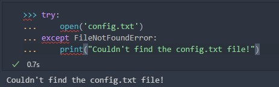

# Tracebacks
Un traceback es el cuerpo del texto que puede apuntar al origen (y al final) de un error no controlado. Comprender los componentes de un traceback hará que seas más eficaz al corregir errores o depurar un programa que no funciona bien.

La primera vez que encuentres excepciones en Python podrías verte tentado/a a evitar el error suprimiéndolo. Cuando un programa sufre un error no controlado, aparece un traceback como salida. Como verás en este módulo, los tracebacks son útiles. Hay maneras de controlar correctamente los errores para que no aparezcan o muestren información útil.

Si intentamos en un notebook, abrir un archivo inexistente sucede lo siguiente:


### Intenta crear un archivo de Python y asígnale el nombre prueba.py, con el contenido siguiente:
```
def main():
    open("/path/to/mars.jpg")
if __name__ == '__main__':
    main()
```


# Try y Except de los bloques



Después de la palabra clave try, agregamos código que tenga la posibilidad de producir una excepción. A continuación, agregamos la palabra clave except junto con la posible excepción, seguida de cualquier código que deba ejecutarse cuando se produce esa condición. Puesto que config.txt no existe en el sistema, Python imprime que el archivo de configuración no está ahí. El bloque try y except, junto con un mensaje útil, evita un seguimiento y sigue informando al usuario sobre el problema.

