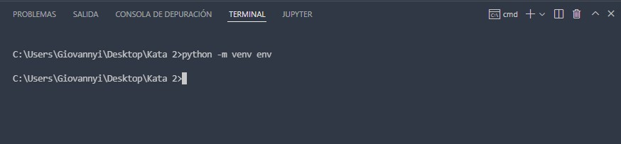
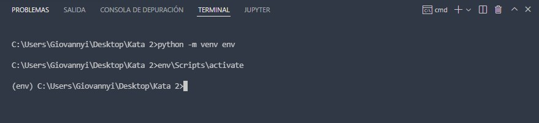
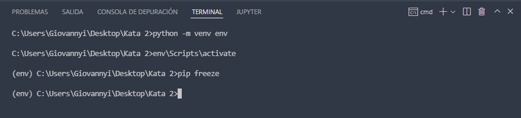
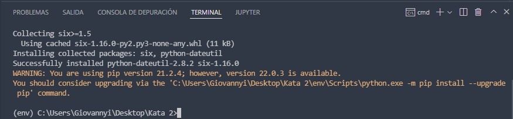
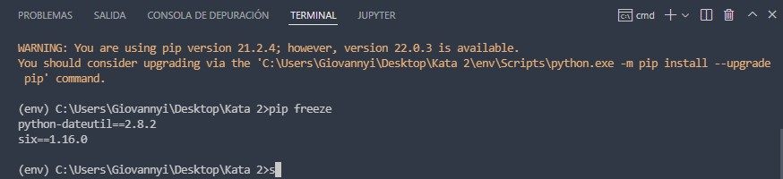
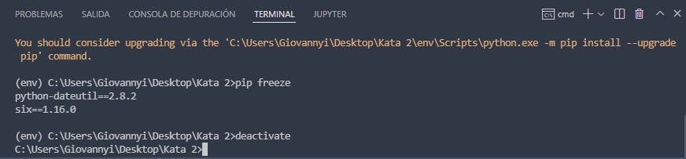

# Kata 2 Crear entorno virtual

Primero creamos un entorno virtual mediante ``venv``

* Ejecutamos en la terminal para activar el entorno virtual ``env\Scripts\activate``
 

# Instalamos una biblioteca
Ahora en el entorno virtual podremos intalarlo y saber que solo existe en el entorno virtual. Ejecutamos el comando ``pip freeze``para ver las bibliotecas instaladas en el entorno

Como vemos no aparece nada aún. Ahora instalaremos un paquete para ver como cambia la salida.

* Ejecutamos el comando ``pip install python-dateutil``, para instalar una biblioteca:

* El mensaje de salida nos indica que ya se intaló correctamente.

* Ejecutamos de nuevo el comando ``pip freeze`` para ver como ha cambiado la lista.

# Desactivar entorno virtual

Y ya por ultimo lo unico que haremos será desactivar el entorno virtual, ejecutando el comando ``deactivate``

Ahora la frase ``eve`` se ha quitado de nuetra terminal.
